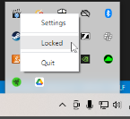
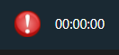

# usage

## Required Software

1. Install the [obs-websocket-plugin](https://github.com/Palakis/obs-websocket) and configure the **port** and **password** (optional). The default value `4444` works just fine.

### Windows

Due to a bug in [electron](https://github.com/electron/electron/issues/10078) the application does not stay on top of full screen games.

* Download one of the AlwaysOnTop solutions
  * [Other Windows Options](https://www.groovypost.com/howto/howto/windows-programs-always-on-top/)
  * [AlwaysOnTop](https://github.com/jparnell8839/AlwaysOnTop/releases)

## Settings

1\. If you changed the defaults, use the Tray and select _Settings_

2\. Configure the Port and Password and select _Apply_ (you may have to restart the application if it already connected to OBS)

## Application Modes

The overlay can be resized/moved when the application is not in a _Locked_ state. Once you are content with the size and location of the overlay, _lock_ the application and the background will disappear.

## Overlay Modes

There are currently two display modes:

* Timer
* Logo

### Timer

Displays an alert and timer that tracks the status of a recording:

_unlocked & not recording_

_not recording_

_recording_

### Logo

Displays a faded/unfaded logo that tracks the status of a recording:

_unlocked & not recording_

_not recording_

_recording_

## Tray

The recording status will also report on the application's icon on the tray:

_not recording_

_recording_

